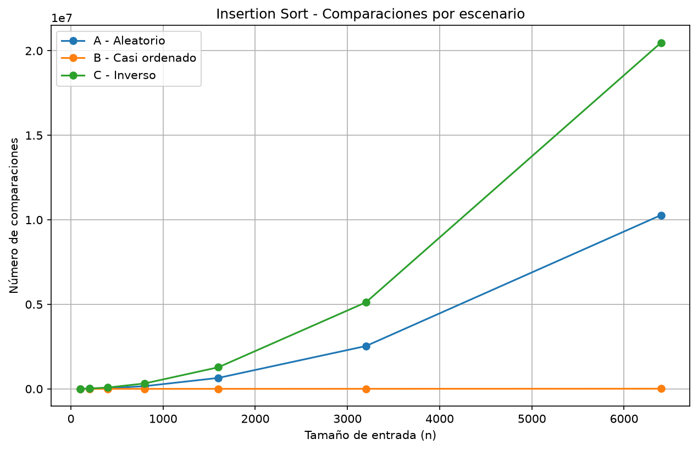
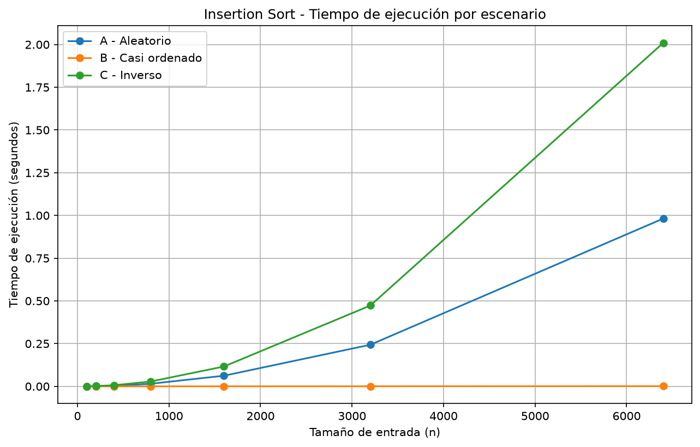
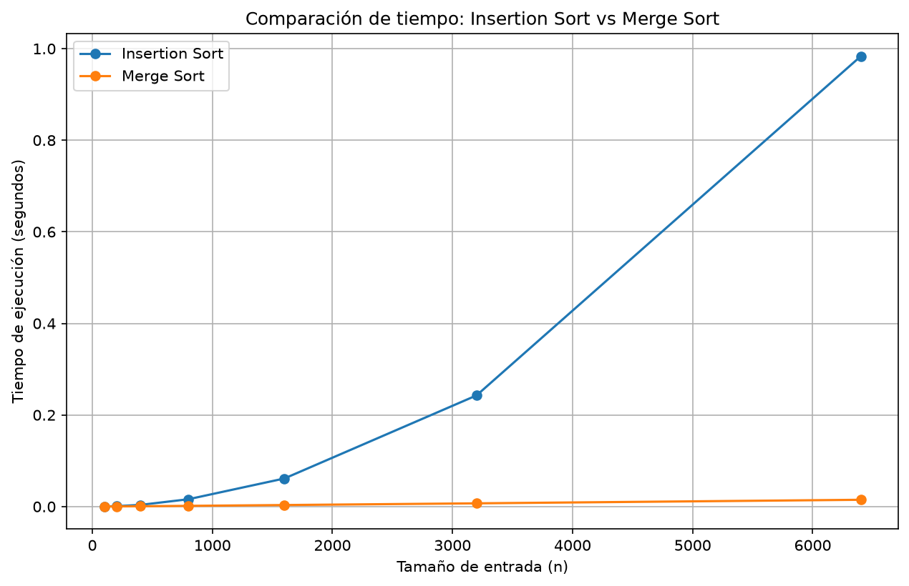

# Laboratorio evaluativo 01 — Fundamentos, complejidad y recurrencias

**Nombre:** Julián David Agudelo Acevedo

## Instrucciones para reproducir el laboratorio

El laboratorio está dentro de la carpeta `lab1-fundamentos-complejidad-recurrencias`

Primero se activa el entorno virtual desde la raíz del repositorio

```bash
source venv/Scripts/activate
```

Después se entra a la carpeta del laboratorio

```bash
cd lab1-fundamentos-complejidad-recurrencias
```

Para correr la Parte 3

```bash
python parte3_casos.py
```

Para correr la Parte 4

```bash
python parte4_complejidad.py
```

Las gráficas quedan guardadas en la carpeta `graficas`

---

# Parte 1 — Analizar el algoritmo antes de comprar hardware

En este caso hay algo que me parece importante separar desde el principio

Una cosa es que el algoritmo sea correcto y otra es que alcance a hacer su trabajo dentro del tiempo que tiene disponible

Insertion Sort es correcto porque finalmente puede dejar los registros en el orden que Tamiza necesita. El problema es que ahora hay **1.200.000 registros** y todos tienen que quedar organizados de mayor a menor riesgo entre las **2:00 a. m. y las 6:00 a. m.**

Entonces la restricción que se está incumpliendo es la ventana de **4 horas**

Como el algoritmo actual tiene un comportamiento que puede crecer mucho cuando aumenta la cantidad de datos, que haya funcionado durante ocho años no significa que siga siendo una buena opción para la cantidad de información que maneja actualmente Tamiza

Duplicar la velocidad del servidor puede ayudar a que el proceso tarde menos, pero no cambia el algoritmo que está haciendo el trabajo. Es como poner un equipo más rápido a hacer una tarea que cada vez se vuelve mucho más grande. Al principio puede alcanzar, pero si la cantidad de registros sigue creciendo el mismo problema puede volver a aparecer

Por eso antes de gastar en hardware revisaría primero el algoritmo. Si el problema está en la forma como crece el tiempo de ejecución, lo más lógico es mirar esa parte primero y después pensar si todavía hace falta más capacidad de servidor

Un ejemplo parecido podría ser una tienda que tiene que organizar **500.000 pedidos** antes de las 6:00 a. m. para preparar las entregas del día. Supongamos que el algoritmo ordena los pedidos correctamente pero tarda más de la ventana disponible. El resultado sería correcto, pero el sistema no sería viable para esa operación porque no alcanzaría a terminar a tiempo

---

# Parte 2 — Responsabilidad ambiental y ética

Cuando se escoge un algoritmo para un sistema como Tamiza no solamente se debería mirar si funciona. También hay que pensar en lo que pasa como consecuencia del tiempo que dura ejecutándose

Un servidor que está procesando información durante más tiempo también está consumiendo energía durante más tiempo. En una ejecución puede que la diferencia no parezca tan grande, pero Tamiza hace este proceso todas las madrugadas. Como el proceso se repite todos los días durante años, ese consumo también se va acumulando

Por eso usar un algoritmo que necesite mucho más tiempo puede terminar teniendo un impacto ambiental mayor. No es solamente lo que consume una ejecución sino todas las ejecuciones que se van acumulando con el tiempo

También está la parte ética porque aquí los datos pertenecen a personas y el orden de la lista define quién se llama primero

Un primer problema sería que un paciente con un índice de riesgo alto no quede dentro de la lista a tiempo o quede en una posición que no corresponde. Como el centro de contacto empieza desde arriba de la lista, esa persona podría recibir la llamada más tarde de lo que debería. En este caso el costo lo termina asumiendo el paciente

Otro problema puede caer sobre las personas que trabajan en el centro de contacto. Si la lista queda incompleta o desordenada, los operadores pueden tener que revisar información por otros medios o trabajar con una lista que no está lista para usar. Ahí el costo lo asume el operador y también la Secretaría porque el proceso de atención se vuelve más complicado

Además hay algo que hace que este caso sea un poco más delicado. El orden no se usa solamente para organizar información. El orden decide a quién se contacta primero. Entonces el algoritmo debe respetar realmente el índice de riesgo porque una persona con mayor riesgo debería conservar esa prioridad en la lista

---

# Parte 3 — Peor caso, mejor caso y caso promedio

## 3.1 Explicación

El **mejor caso** es la entrada que para un tamaño determinado hace que el algoritmo trabaje lo menos posible

El **peor caso** es la entrada que para ese mismo tamaño hace que el algoritmo trabaje lo máximo posible

El **caso promedio** busca representar lo que normalmente puede pasar si se consideran las diferentes entradas posibles de ese tamaño

En este punto el tamaño debe mantenerse fijo. Por ejemplo si estoy mirando entradas de 1.000 elementos, comparo entre las posibles entradas de esos mismos 1.000 elementos. No sería correcto comparar una entrada de 100 elementos con otra de 1.000 y decir que una es el mejor caso solamente por tener menos datos

Para decidir si Tamiza puede utilizar el algoritmo en producción yo tendría en cuenta principalmente el **peor caso**. Esto es porque la ventana de **4 horas** es fija. No se puede asumir que todos los días los datos van a llegar de la mejor manera posible. Como el canal puede cambiar, el algoritmo debería poder responder también cuando la entrada sea desfavorable

Antes de hacer las pruebas mi predicción fue esta

- **Escenario A — aleatorio:** aproximación al caso promedio
- **Escenario B — casi ordenado:** mejor caso o muy cercano al mejor caso
- **Escenario C — inverso:** peor caso

La idea era que Insertion Sort debería comportarse mucho mejor cuando la lista ya viene ordenada. Como en el escenario B el **98 %** está ordenado y el otro **2 %** está al final, esperaba que necesitara muchas menos comparaciones

En cambio en el escenario C los datos llegan exactamente al contrario del orden que Tamiza necesita. Como cada elemento tiene que ir pasando sobre muchos elementos anteriores, esperaba que este fuera el peor caso

El código usado para esta parte está en [`parte3_casos.py`](parte3_casos.py)

El algoritmo está en [`algoritmos.py`](algoritmos.py) y los generadores están en [`datos.py`](datos.py)

## 3.2 Resultados

Se probaron siete tamaños de entrada

**100, 200, 400, 800, 1600, 3200 y 6400 elementos**

El tiempo se tomó solamente durante la ejecución del algoritmo usando `time.perf_counter()`. La generación de los datos se hizo antes de empezar a medir

### Comparaciones

| Tamaño | Aleatorio | Casi ordenado | Inverso |
|---:|---:|---:|---:|
| 100 | 2.542 | 100 | 4.950 |
| 200 | 9.970 | 203 | 19.900 |
| 400 | 40.436 | 417 | 79.800 |
| 800 | 160.484 | 866 | 319.600 |
| 1.600 | 648.481 | 1.851 | 1.279.200 |
| 3.200 | 2.533.103 | 4.172 | 5.118.400 |
| 6.400 | 10.276.753 | 10.277 | 20.476.800 |



### Tiempo

| Tamaño | Aleatorio (s) | Casi ordenado (s) | Inverso (s) |
|---:|---:|---:|---:|
| 100 | 0,000227 | 0,000011 | 0,000418 |
| 200 | 0,000919 | 0,000019 | 0,001661 |
| 400 | 0,003640 | 0,000045 | 0,006707 |
| 800 | 0,015132 | 0,000097 | 0,028311 |
| 1.600 | 0,062131 | 0,000209 | 0,116049 |
| 3.200 | 0,243449 | 0,000472 | 0,472831 |
| 6.400 | 0,981710 | 0,001110 | 2,009349 |



### Lo que muestran las pruebas

Los resultados fueron como esperaba

El escenario B fue el que menos comparaciones tuvo. También fue el que menos tiempo necesitó. Esto tiene sentido porque el **98 % de los datos ya estaba ordenado** y solamente se agregó el **2 %** restante al final

El escenario C fue todo lo contrario. Tuvo la mayor cantidad de comparaciones y también el mayor tiempo. Con **6.400 elementos** llegó a **20.476.800 comparaciones**

Entonces para el orden de mayor a menor que se escogió en este laboratorio, el escenario C representa el peor caso

El escenario A quedó entre los dos. Por eso se puede tomar como una aproximación al caso promedio

Algo que se nota bastante en la gráfica es como el tiempo empieza a crecer rápido cuando aumenta la cantidad de datos. En el escenario inverso se pasa de **5.118.400 comparaciones con 3.200 elementos** a **20.476.800 con 6.400 elementos**. Es decir, al duplicar el tamaño las comparaciones aumentan aproximadamente cuatro veces

Eso es justamente lo que se espera de un comportamiento cuadrático

---

# Parte 4 — Complejidad de Merge Sort e Insertion Sort

## 4.1 Cálculo teórico

Para Merge Sort se tiene la siguiente recurrencia

```text
T(n) = 2T(n/2) + Θ(n)
```

El `2T(n/2)` aparece porque el algoritmo divide la lista en dos partes. Como son dos partes, se tienen dos problemas y cada uno tiene aproximadamente `n/2` elementos

Después viene la parte de mezclar las dos listas. Como para hacer esa mezcla hay que revisar los elementos de las dos partes, ese trabajo tiene un costo de `Θ(n)`

Para resolver la recurrencia usé el **árbol de recurrencia**

Se puede ver más o menos así

```text
                         T(n)
                       /      \
                  T(n/2)     T(n/2)
                  /   \       /   \
             T(n/4) T(n/4) T(n/4) T(n/4)
                 ...           ...
```

En el primer nivel se tiene un costo de `Θ(n)`

En el siguiente nivel hay más problemas pero entre todos siguen teniendo `n` elementos. Por eso el costo total de ese nivel también es `Θ(n)`

Esto sigue pasando en los demás niveles

La cantidad de niveles depende de cuántas veces se puede dividir `n` entre 2 hasta llegar a 1

```text
log₂(n)
```

Entonces el costo queda como

```text
Θ(n) + Θ(n) + Θ(n) + ... 
```

durante aproximadamente `log₂(n)` niveles

Por eso

```text
T(n) = Θ(n log n)
```

y la cota de Merge Sort es

```text
O(n log n)
```

### Insertion Sort línea por línea

En Insertion Sort la situación cambia bastante según como venga la lista

En el mejor caso la lista ya viene en el orden que necesitamos. En ese caso cada elemento se compara una vez con el elemento anterior para verificar que ya está donde debe. Como esto se hace para los `n - 1` elementos después del primero, el número de comparaciones es

```text
n - 1
```

Entonces el crecimiento es

```text
O(n)
```

En el peor caso la lista viene completamente al contrario. En ese caso el segundo elemento se compara una vez, el tercero dos veces, el cuarto tres veces y así sucesivamente

La cantidad de comparaciones queda

```text
1 + 2 + 3 + ... + (n - 1)
```

La suma es

```text
n(n - 1) / 2
```

Al mirar solamente el término que más crece, queda

```text
O(n²)
```

En el caso promedio el comportamiento también es cuadrático porque en promedio los elementos todavía tienen que desplazarse una cantidad importante de posiciones

```text
O(n²)
```

### Tabla de complejidades

| Algoritmo | Mejor caso | Caso promedio | Peor caso |
|---|---|---|---|
| Insertion Sort | O(n) | O(n²) | O(n²) |
| Merge Sort | O(n log n) | O(n log n) | O(n log n) |

---

## 4.2 Validación con las pruebas

Para esta parte comparé Insertion Sort y Merge Sort usando el escenario A, con los mismos tamaños de la Parte 3

El código utilizado para esta comparación está en [`parte4_complejidad.py`](parte4_complejidad.py)

La implementación de los algoritmos se encuentra en [`algoritmos.py`](algoritmos.py)

| Tamaño | Insertion Sort (s) | Merge Sort (s) |
|---:|---:|---:|
| 100 | 0,000233 | 0,000156 |
| 200 | 0,000914 | 0,000321 |
| 400 | 0,003636 | 0,000706 |
| 800 | 0,016003 | 0,001544 |
| 1.600 | 0,061355 | 0,003345 |
| 3.200 | 0,242737 | 0,007049 |
| 6.400 | 0,983318 | 0,014816 |



En las pruebas Merge Sort fue más rápido que Insertion Sort en todos los tamaños

Lo que más se nota es como la diferencia va aumentando cuando también aumenta el tamaño de la entrada. Con **6.400 elementos** Insertion Sort tardó **0,983318 segundos**, mientras que Merge Sort tardó **0,014816 segundos**

Esto coincide con lo que salió en el análisis teórico. Insertion Sort tiene un crecimiento `O(n²)` para el caso promedio mientras que Merge Sort tiene `O(n log n)`

En tamaños pequeños puede pasar que las diferencias no sean tan grandes. Merge Sort también tiene algunos costos como las llamadas recursivas y la creación de listas para hacer la mezcla. Pero cuando el tamaño empieza a crecer se nota como el comportamiento de Merge Sort es mucho más favorable

---

# 4.3 Memo técnico para el equipo de ingeniería

Para Tamiza recomiendo utilizar **Merge Sort** como algoritmo principal de ordenamiento

La decisión la tomo pensando principalmente en que el canal de entrada puede cambiar. No se puede garantizar que los registros siempre van a llegar casi ordenados como pasa en el escenario B. Hoy puede funcionar así y mañana el flujo puede cambiar

Insertion Sort tiene un comportamiento muy bueno cuando los datos están casi ordenados. El problema es que cuando llegan aleatorios o en orden inverso el tiempo aumenta bastante

Esto se puede ver en las mediciones. Con **6.400 elementos** y el escenario A, Insertion Sort tardó **0,983318 segundos** mientras que Merge Sort tardó **0,014816 segundos**. Como el tamaño aumenta la diferencia también se vuelve más grande

Para los **1.200.000 registros** no se hizo una medición directa. Por eso los valores que siguen son una **estimación** basada en las pruebas realizadas

Para Insertion Sort se tomó el tiempo de **0,983318 segundos** con 6.400 elementos y se utilizó el comportamiento cuadrático que mostró el algoritmo. Pasar de 6.400 a 1.200.000 elementos significa aumentar el tamaño unas **187,5 veces**. Si el tiempo crece aproximadamente con el cuadrado de ese factor, el resultado queda cerca de **9,6 horas**

Para el escenario inverso la estimación es todavía mayor. Tomando los **2,009349 segundos** medidos con 6.400 elementos, el tiempo estimado para 1.200.000 registros sería aproximadamente **19,6 horas**

Estos valores no son mediciones directas. Son estimaciones hechas a partir de la forma de crecimiento observada

Para Merge Sort se tomó como referencia el tiempo de **0,014816 segundos** con 6.400 elementos y se utilizó el crecimiento `n log n`. Con esta aproximación el tiempo para 1.200.000 elementos queda cerca de **4,4 segundos**. Nuevamente esto es una estimación y no una ejecución real con 1.200.000 registros

Con estos resultados no veo suficiente la propuesta de simplemente comprar un servidor con el doble de velocidad

Por ejemplo, si se toma la estimación de **9,6 horas** para Insertion Sort y se supone que un servidor del doble de velocidad reduce el tiempo exactamente a la mitad, todavía quedarían unas **4,8 horas**. Eso sigue estando por encima de las **4 horas** que tiene Tamiza

Entonces el cambio de hardware podría ayudar pero no soluciona de fondo el crecimiento del algoritmo

Hay otro punto que también se debe tener en cuenta y es la memoria. Merge Sort necesita memoria adicional para dividir y mezclar las listas. Ese es un costo que Insertion Sort no tiene de la misma forma. Aun así, en este caso considero que vale más la pena asumir ese costo de memoria que mantener un algoritmo que puede tardar demasiado cuando aumente la cantidad de registros

También me parece importante que Merge Sort sea una opción más estable frente a los diferentes escenarios. Como no depende de que la lista llegue casi ordenada, el cambio en el canal de entrada no afecta de la misma manera su comportamiento

Por todo esto la recomendación es utilizar **Merge Sort** y hacer una prueba final con una cantidad de datos cercana a los **1.200.000 registros** antes de llevar el cambio a producción. Así se podría comprobar directamente el consumo de memoria y el tiempo real del proceso en un ambiente controlado
