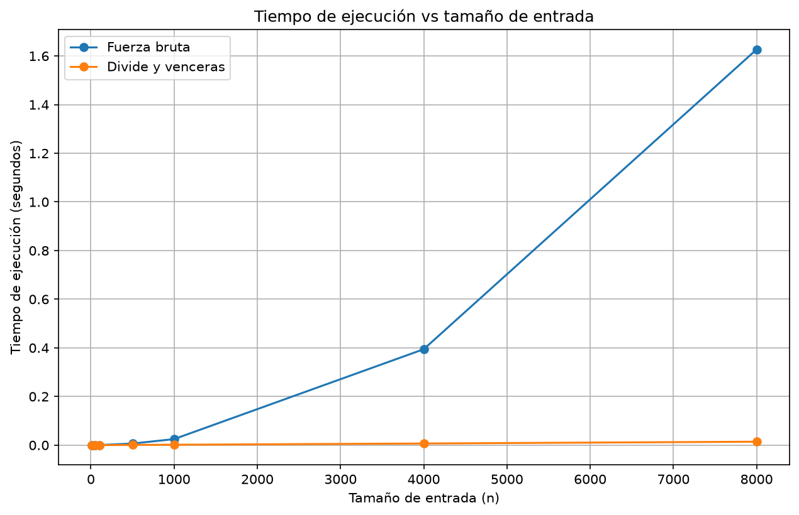

# Laboratorio evaluativo 02 — Dividir y vencer

**Nombre:** Julián David Agudelo Acevedo

## Instrucciones para reproducir el laboratorio

El laboratorio está en la carpeta `lab2-divide-y-vencer`.

Primero se activa el entorno virtual desde la raíz del repositorio:

```bash
source venv/Scripts/activate
```

Después se entra a la carpeta:

```bash
cd lab2-divide-y-vencer
```

Para ejecutar las pruebas:

```bash
python pruebas.py
```

Para realizar las mediciones y generar la gráfica:

```bash
python medicion.py
```

La gráfica se guarda en la carpeta `graficas`.

---

# Parte 1 — Implementación y pruebas

Para resolver el problema de la cooperativa hice las dos soluciones que pide la guía: fuerza bruta y divide y vencerás.

El código de los algoritmos está en [`subarreglo.py`](subarreglo.py) y las verificaciones están en [`pruebas.py`](pruebas.py).

En fuerza bruta se revisan los posibles tramos de días y se va acumulando su suma. Así no hay que volver a sumar desde cero todos los valores de cada tramo.

En divide y vencerás se separa la lista en dos partes. Después se busca la mejor racha de la izquierda, la de la derecha y la que cruza el punto medio. Al final se escoge la que tenga la mayor suma.

Para revisar que funcionaran probé el ejemplo de los ocho días, una lista con un solo elemento, listas con todos los valores negativos y positivos, un caso cruzado y 20 listas aleatorias. En estas últimas comparé las sumas que devolvían ambos algoritmos.

Con el ejemplo `[-3, 5, -2, 8, -6, 3, 9, -4]`, los dos obtuvieron la suma máxima de **17**.

Al ejecutar `python pruebas.py` salió:

```text
Todas las pruebas pasaron correctamente.
```

---

# Parte 2 — Medición y gráfica

El código de esta parte está en [`medicion.py`](medicion.py).

Se probaron siete tamaños: **10, 50, 100, 500, 1000, 4000 y 8000** elementos. Los valores se generaron entre -100 y 100 con una semilla fija, usando la misma lista para los dos algoritmos en cada tamaño.

El tiempo se tomó con `time.perf_counter()` solamente durante la ejecución de cada algoritmo. No se incluyó la generación de los datos. Hice una medición por tamaño y también comprobé que las sumas de ambos algoritmos coincidieran.

| Tamaño | Fuerza bruta (s) | Divide y vencerás (s) |
|---:|---:|---:|
| 10 | 0,000013 | 0,000023 |
| 50 | 0,000075 | 0,000079 |
| 100 | 0,000394 | 0,000161 |
| 500 | 0,006411 | 0,000760 |
| 1.000 | 0,024806 | 0,001575 |
| 4.000 | 0,394333 | 0,006711 |
| 8.000 | 1,626822 | 0,014091 |



---

# Parte 3 — Análisis

## 3.1 Recurrencia y complejidad

En divide y vencerás se crean dos subproblemas de aproximadamente la mitad del tamaño. Además, hay que revisar el tramo que cruza el punto medio. Como para encontrarlo se recorren las dos mitades, ese paso cuesta `Θ(n)`.

La recurrencia queda así:

```text
T(n) = 2T(n/2) + Θ(n)
```

Para aplicar el método maestro tenemos `a = 2`, `b = 2` y `f(n) = Θ(n)`. Al calcular `n^(log₂ 2)` se obtiene `n`. Como `f(n)` tiene el mismo crecimiento que `n^(log₂ 2)`, se cumple el segundo caso del método maestro. Por eso el resultado es **Θ(n log n)**.

En fuerza bruta se usan dos ciclos: uno escoge el inicio del tramo y el otro recorre los posibles finales. Aunque la suma se va acumulando, se revisan aproximadamente `n(n + 1)/2` tramos. Por eso su complejidad es **Θ(n²)**.

## 3.2 Lo medido frente a lo esperado

En la gráfica se nota que fuerza bruta empieza a crecer mucho más rápido. Divide y vencerás también aumenta su tiempo, pero la diferencia entre los dos se vuelve cada vez mayor.

Por ejemplo, al pasar de **4.000 a 8.000 elementos**, fuerza bruta pasó de **0,394333** a **1,626822 segundos**. Eso significa que tardó unas **4,13 veces** más.

En divide y vencerás se pasó de **0,006711** a **0,014091 segundos**, aproximadamente **2,10 veces** más.

Esto se parece a lo esperado: con `Θ(n²)` duplicar el tamaño puede multiplicar el trabajo por cuatro, mientras que con `Θ(n log n)` el aumento es un poco mayor al doble.

## 3.3 Tamaños pequeños

En mis pruebas divide y vencerás empezó a ganar desde los **100 elementos**. Con 10 elementos fuerza bruta fue un poco más rápida y con 50 los tiempos fueron casi iguales.

Esto puede pasar porque dividir la lista y hacer llamadas recursivas también tiene un costo. En listas pequeñas esa diferencia todavía no se aprovecha tanto, pero cuando aumenta la cantidad de datos sí se nota.

## 3.4 ¿Siempre conviene dividir?

No necesariamente. Si solamente necesitamos encontrar el número más grande de una lista, podemos recorrerla una vez y guardar el mayor. Eso ya cuesta `Θ(n)`.

Si la dividimos en dos, encontramos el máximo de cada mitad y al final comparamos ambos resultados. En ese caso la recurrencia sería:

```text
T(n) = 2T(n/2) + Θ(1) = Θ(n)
```

El costo de combinar es constante porque solamente se comparan dos valores. Entonces dividir no mejora el orden de crecimiento frente a recorrer la lista directamente. En el subarreglo máximo sí aporta una mejora importante frente a la fuerza bruta.

## 3.5 Recomendación para la cooperativa

Para la cooperativa escogería **divide y vencerás** porque el equipo también quiere analizar series mucho más grandes. Con **8.000 elementos**, fuerza bruta tardó **1,626822 segundos**, mientras que divide y vencerás necesitó **0,014091 segundos**.

Para estimar qué pasaría con **1.000.000 de registros** tomé esos tiempos como referencia y apliqué el crecimiento de cada algoritmo. No es una medición real con un millón de datos.

El tamaño aumenta **125 veces**. En fuerza bruta, por su crecimiento cuadrático, el factor sería `125²`. Eso daría aproximadamente **25.419 segundos**, es decir, **7,1 horas**.

En divide y vencerás utilicé la proporción entre `1.000.000 log₂(1.000.000)` y `8.000 log₂(8.000)`. Con esa aproximación el tiempo sería de unos **2,7 segundos**.

Por eso recomendaría divide y vencerás para este caso. Aunque con pocos datos la diferencia no es tan grande, las mediciones muestran que con listas más extensas fuerza bruta deja de ser una buena opción. Antes de usarlo en un sistema real también haría una prueba con un volumen cercano al esperado.
